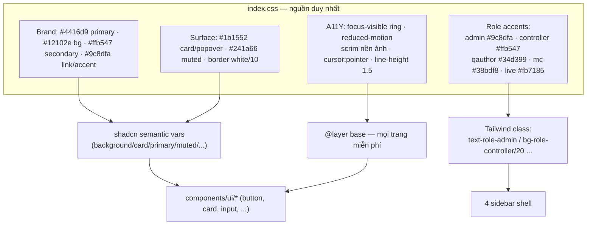
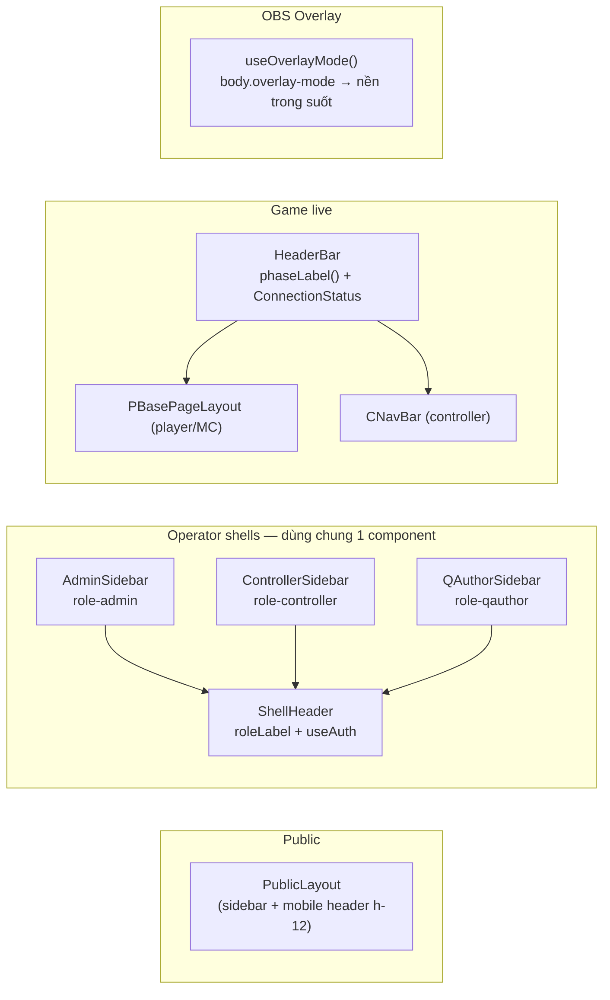
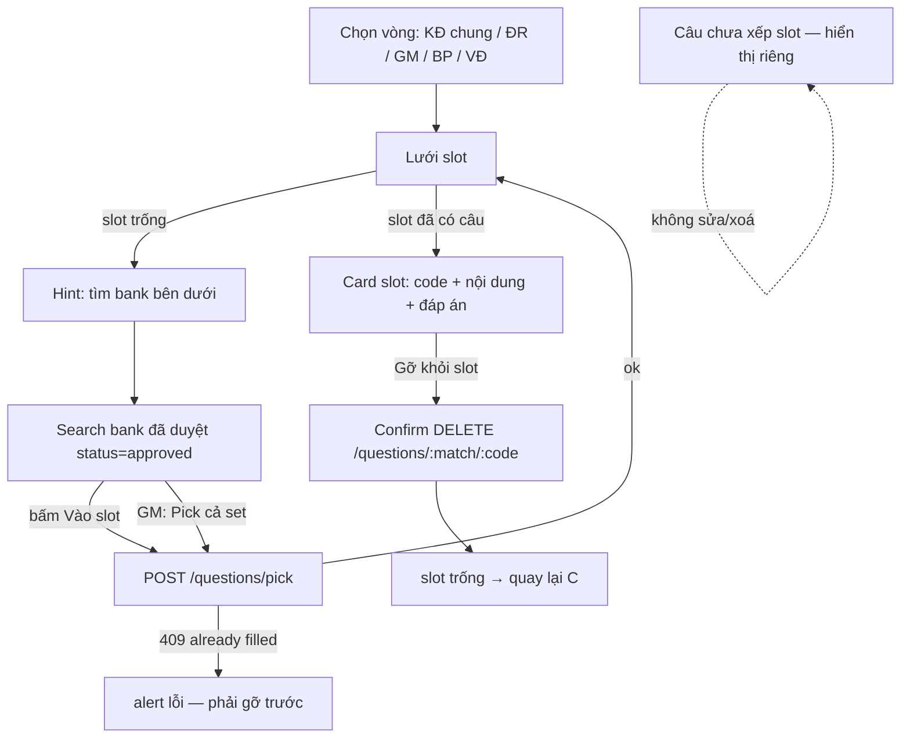
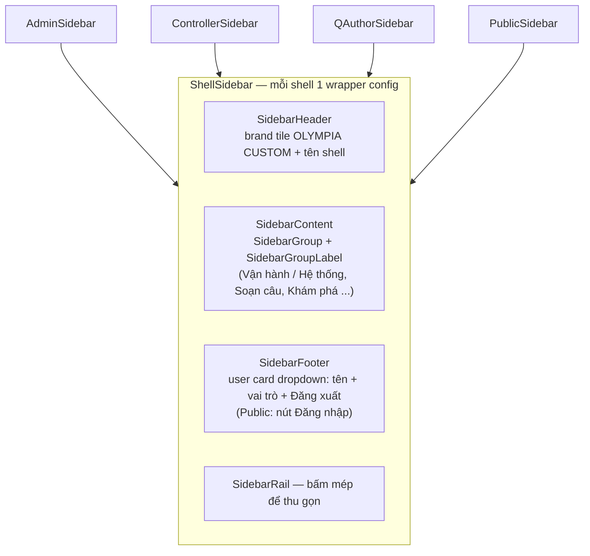
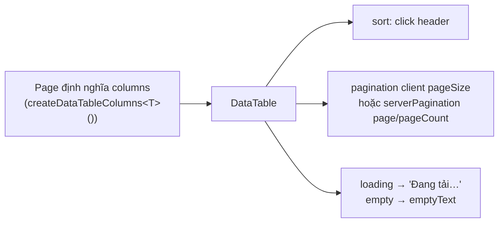
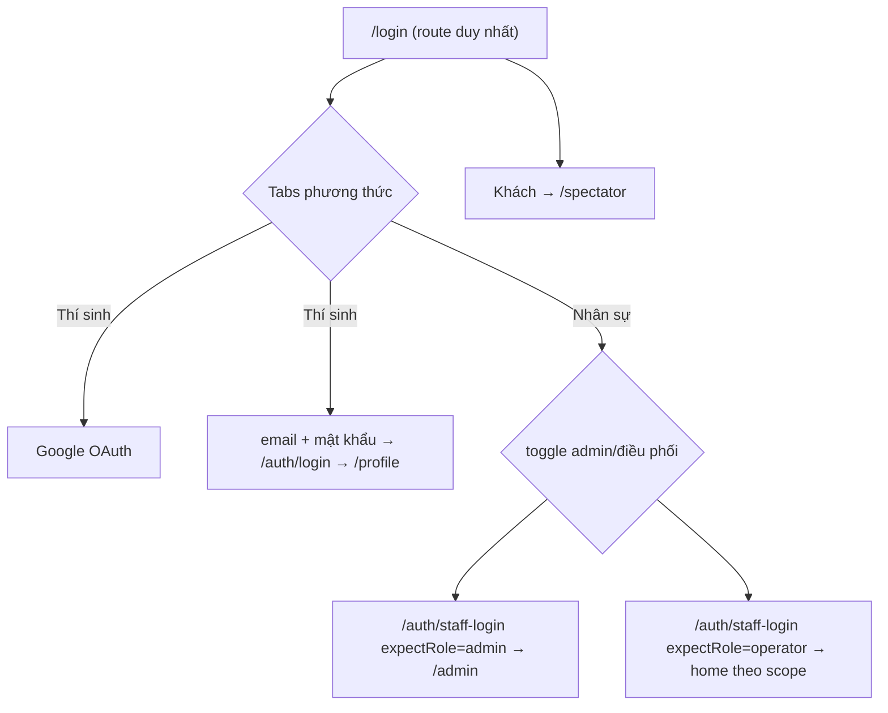

# UI/UX Redesign — Olympia Custom (apps/web)

> Ngày: 2026-10 · Phạm vi: toàn bộ 9 surface · Hướng: giữ brand violet, tinh chỉnh
> Nguồn token thật: `apps/web/src/index.css` (file này ghi đè `design-system/olympia-custom/MASTER.md` nếu lệch)

---

## 1. Vấn đề phát hiện khi audit

| # | Vấn đề | Ảnh hưởng | Đã sửa |
|---|--------|-----------|--------|
| 1 | `a { color: #4416d9 }` trên nền `#12102e` ≈ 2.4:1 | Link không đọc được (WCAG fail) | ✓ `--oc-link: #9c8dfa` |
| 2 | Background ảnh `fixed` không scrim | Chữ nổi trên ảnh, khó đọc | ✓ gradient scrim 2 lớp (body + `::before`) |
| 3 | `.card` global padding 2.5rem + max-w cố định | Trang chống lại bằng `p-6!`, auth thêm inline style | ✓ `.card` p-7, bỏ inline style |
| 4 | `PHASE_NAMES` trùng 3 bản; 3 header copy y hệt; connection pill copy nhiều nơi | Sửa 1 chỗ, 2 chỗ quên | ✓ `lib/gameMeta.ts`, `ShellHeader`, `ConnectionStatus` |
| 5 | 3 kiểu heading (`font-[SVN-Gratelos_Display]` thô, `font-display`, `font-heading`) | Typography lệch nhau từng trang | ✓ gộp về `font-display` (38 chỗ) |
| 6 | Dead CSS: `.hide-mobile` family, `.bottom-nav`, `.score-pulse`, `.accent-dot`, hack `.lg\:grid-cols-2`; file chết `PublicHeader`, `GameHeader` | CSS phình, gây hiểu nhầm | ✓ xóa |
| 7 | Overlay OBS set `body background` nhưng quên `body::before` | Ảnh brand lòe sau overlay OBS | ✓ `useOverlayMode()` + `body.overlay-mode` |
| 8 | Màu accent mỗi surface hardcode (`orange-400`, `success`, `red-600`…) | Không kiểm soát được, lệch token | ✓ role tokens |
| 9 | Auth: lỗi chỉ là `text-xs` đỏ, input 32px, placeholder-only label | Lỗi khó thấy, touch target nhỏ | ✓ `AuthError` (role=alert), input 44px, aria-label |

---

## 2. Kiến trúc token (sau redesign)

## 3. Layout system 9 surface

## 4. Quy tắc thiết kế (áp dụng khi làm trang mới)

1. **Màu**: chỉ dùng token (`role-*`, `success/warning/destructive`, `text-foreground`). Không hardcode hex/Tailwind palette (`orange-600`, `slate-600`, `text-white`) — dùng `text-foreground` thay `text-white`.
2. **Typography**: body Inter 16px/1.5; tiêu đề lớn/hero = `font-display` (SVN-Gratelos); tiêu đề card = `font-heading`.
3. **Touch**: control ≥ 36px (button `default` h-9), input 44px (`authInputClass`), vùng bấm ≥ 44px trên tablet (`touch-target`).
4. **Responsive**: grid stat 3 cột giữ `grid-cols-3`; form 2 cột hạ `grid-cols-1 sm:grid-cols-2` khi có input to; table để component `<Table>` lo (đã có `overflow-x-auto`).
5. **Feedback**: lỗi form dùng `<AuthError>` (`role=alert`); nút async hiện label loading; kết nối WebSocket dùng `<ConnectionStatus>`.
6. **Overlay OBS**: mọi trang overlay PHẢI gọi `useOverlayMode()` (không tự `<style>` set background).

## 5. Kiểm chứng

- `pnpm typecheck` (turbo toàn repo): 10/10 pass
- `pnpm build` (apps/web): pass — `✓ built in 6.27s`
- `pnpm lint` (apps/web): **exit 0** — 0 lỗi, 3 warning exhaustive-deps cũ (BankTab + VeDich×2, không phải lỗi)
- Sweep contrast: 0 chỗ `text-white` còn lại; nút success/warning/info đổi sang `*-foreground` tương ứng
  (trắng trên xanh #16a34a chỉ 3.3:1, trắng trên amber 2.1:1 → đều fail WCAG)
- Visual: login + public shell kiểm tra bằng Chrome DevTools ở 375px và 1440px, không lỗi JS console (chỉ 401/500 do preview không có backend)

## 6. Tab "Câu hỏi trận" — tinh chỉnh (2026-10)

Quyết định: bỏ box Danh sách (thông tin chuyển vào card slot), bỏ nút Sửa/Xoá rời rạc,
chỉ giữ "Gỡ khỏi slot" — vì `POST /questions/pick` trả 409 khi slot đã có câu.

Cũng trong lần này: tự tải câu hỏi khi mount (nếu có mã trận lưu sẵn), gộp 2 nút Tải/trùng
thành 1 (có trạng thái "Đang tải…"), thêm loading/empty state cho bank list, bỏ pills progress
trùng lặp ở box header (progress sống ở tabs vòng của zone Pick).

**Update 19:30 — layout 2 cột:** header row gộp `h1 + mã trận + Tải + Soạn câu` (bỏ box input
trống chiếm chỗ); vùng Pick chia 2 cột desktop: **trái** = vòng + lưới slot + detail slot + chưa xếp,
**phải** = "Bank đã duyệt · {slot}" + ô tìm + kết quả dạng card cuộn (`max-h-26rem`) + empty state
icon; stack 1 cột trên mobile, separator `border-l` chỉ ≥1024px.

**Update 20:11 — bỏ tabs, ma trận toàn cục:**
- Vòng thi không còn ẩn sau tabs. Cột trái hiện đủ5 vòng
(KĐ chung/riêng, Giải mã, Bứt phá, Về đích) với progress từng vòng; mỗi slot là ô 48×44px có trạng thái
thẳng (viền dashed = trống, xanh = đã có, viền tím + ring = đang chọn) + legend. Click ô bất kỳ →
`setPickRound(roundOfSlot(slot))` → bank bên phải tự lọc đúng vòng của ô đó. `tileLabel` rút gọn
(KDR `1..6`, GM `KEY/H1..H8`, VD `20..50`).

**Update 09:20 — bố cục cột + sticky:**
- Cột: `lg:grid-cols-[minmax(0,32rem)_minmax(0,1fr)]` — ma trận giữ 512px (đủ 9 ô GM 1 hàng), Bank lấy phần còn lại
- Progress `0/6` chuyển thành pill sát tên vòng (bỏ `justify-between` đang tách count ra mép phải cột)
- **Bank column sticky** `lg:sticky lg:top-16 lg:self-start` (dưới ShellHeader 48px): cuộn ma trận 63 ô vẫn thấy ô tìm + kết quả; đóng vai card `border + bg-background/25 + p-4` thay border-l chìm

**Update 09:46 — Bank mặc định tất cả:**
- Mount → fetch `bank/search?status=approved&limit=100` (server cap) **không round_hint** — hiện toàn bộ bank
- Bấm ô slot → auto-fetch lọc `round_hint` theo vòng của slot (VD kèm domain/difficulty matrix); bỏ chọn → về tất cả
- Search debounce 300ms (state `bankQueryDebounced`); nút Tìm fetch ngay bằng `fetchBank(bankQuery)`
- Bỏ state `pickRound` — derive `bankRound = selSlot ? roundOfSlot(selSlot) : null`; `reuseFromBank` tính round từ slot thật
- Nút theo dòng: KEY → "Pick cả set" (không cần chọn slot, thiếu mã trận có alert); hint H1-8 → "Chỉ pick set" disabled; dòng thường → `Vào {slot}` / "Chọn slot"
- Nhãn cột `Bank đã duyệt · tất cả vòng` / `· KDC_3`; ghi chú `Hiển thị X/100 câu` khi vượt cap

**Update 10:28 — toolbar trái + cột trái scroll + gỡ tiêu đề page:**
- MatchTab: dời `[mã trận | Tải] [Soạn câu]` vào ĐẦU cột trái; cột trái có
  `lg:max-h-[calc(100vh-9rem)] lg:overflow-y-auto` — cuộn ma trận độc lập, cột Bank đứng yên
- **Gỡ toàn bộ h1 tiêu đề chrome ở18 trang shell** (admin/controller/qauthor/mc + player qualifier + MatchTab);
  số liệu giữ lại dạng pill data (`{n} giải`, `({n} log)`, `{n} bộ`, `({n} token)`)
- GIỮ h1 là nội dung/data: auth card, tên giải (tournament detail), profile (tên user), hero spectator,
  "Overlay Preview", tiêu đề game (Waiting/MGameAccess/CNewBase), RulesPage hero, brand HeaderBar
- Row chỉ còn nút action → đổi `justify-between` → `justify-end`; dọn 9 icon import thừa (TS6133)

**Update 10:37 — tạm ẩn Overlay:**
- Cờ `ENABLE_OVERLAY = false` trong `configs.ts`
- Route `/overlay/*` → `Navigate to /` khi tắt (link/OBS cũ không trắng trang); bật lại = `true`
- ẩn card "Overlay lên sóng" ở ControllerOverview (cùng cờ)

**Update 13:54 — dock nút màn vòng thi (dồn trái):**
- 3 layout (`CBasePageLayout`, `CNewBaseLayout`, `CVeDichPickLayout`): nút không còn wrap CENTRE dưới
  board → **dock đáy full-width `justify-start`**: nhóm [điều hướng câu | hành động vòng] | divider |
  [nút thí sinh], `statusMessages` sang **phải dock** (`ml-auto`) — hết reflow khi đổi câu
- Player list giữ cột phải, `playerSectionButtons`/`playerActions` chuyển vào dock nhóm 2
- `topControlButtons` (gần như luôn null) gộp chung nhóm 1 với bottom

**Update 15:09 — nút dưới QuestionCard + bỏ NavBar + bỏ title trắng:**
- `CNewBaseLayout`: bỏ h1 "KHỞI ĐỘNG - LƯỢT RIÊNG" (title còn trong interface, caller khỏi sửa);
  `actions` → **ngay dưới QuestionCard, justify-start**; `playerActions` về cột phải dưới danh sách thí sinh
- `CBasePageLayout` + `CVeDichPickLayout`: nút + status về lại dưới QuestionBoard/ma trận, dồn trái;
  `playerSectionButtons` về cột phải
- **Xóa gameplay NavBar**: render trong `CGameShell` + `WaitingPage`, xoá file `navigation/CNavBar.tsx`
  (Sảnh Chờ/Tổng quan đã có sidebar, Đăng xuất đã có footer user card — không mất gì)

**Update 03/10 09:27 — P1 shadcn-ify màn trận:**
- `lib/notify.ts` (`notifyError`/`notifySuccess`) + mount `<Toaster />` ở `App.tsx` — toast bottom-right
- `alert()` ×7 → Toast: WaitingPage (lỗi hoàn thành), CPlayerBar (gửi duyệt), MatchSetPicker ×3 (kích hoạt),
  CScoreEditModal (cập nhật điểm)
- `window.confirm("Xác nhận hoàn thành trận?")` → **AlertDialog** (Huỷ / Hoàn thành) — WaitingPage
- Modal tự làm confirm Từ khoá (GiaiMa) → **AlertDialog** (Title+Description+Cancel/Action)
- Popup `bg-white` Vuốt đéo clue → **Dialog** (dark, Esc + overlay + close chuẩn) — bỏ card trắng giữa nền tối
- Kiểm tra cuối: `grep alert(|window.confirm` trong màn trận = 0

**Update 03/10 09:42 — P2 shadcn-ify:**
- Chip "Trả lời lần 2" (SKhoiDong + KhoiDongRieng) → **Badge** `bg-warning` + animate-pulse
- Lưới ô KĐ (`SKhoiDong boxStates`) → **ToggleGroup multiple** + ToggleGroupItem (roving focus,
  aria tự quản; bridge `api.toggle` bằng diff mảng — value kiểu **string[]** dù single theo Base UI version này,
  index phải `String(index)`) + `aria-label="Câu n"`
- Chọn quyền năng VĐC/VĐR → **ToggleGroup** single (value `selectedPower ? [selectedPower] : []`,
  per-item `disabled` theo điểm), giữ nguyên class selected
- **Progress: không tồn tại thanh tiến độ tự làm nào trong màn trận** → không có chỗ để thay (không làm cưỡng)
- Skip có lý do: lưới PQuestionBoard (hành vi WS-driven qua callback, không có state cục bộ → map sang ToggleGroup rủi ro),
  clue grid Giải mã (PlayerClueCard = card nội dung, không phải toggle)

**Update 03/10 09:53 — Progress + Sheet indent:**
- **Progress (mới dùng primitive `Progress`):**
  1. MatchTab: thanh tiến độ **điền slot toàn trận** `{filled}/{totalSlots} ô` (67 ô) ngay dưới legend cột trái
  2. Upload media: `uploadQuestionMedia(code, file, onProgress?)` đổi PUT `fetch` → **XHR `upload.onprogress`**
     (fetch không có progress event); BankTab giữ `uploadPct` state → EditBankSidebar hiện
     `Đang upload N%` + thanh Progress khi submit
- **Sheet indent:** `SheetContent` gốc không padding, header/footer `p-4` nhưng body =0 → content dính mép.
  Sửa ở `SidePanel` (không sửa Sheet chung — Sheet còn cho sidebar mobile): body `px-4 pb-4`

**Update 10:05 — Pagination dạng số:**
- `DataTablePager` trong `data-table.tsx` dùng shadcn `Pagination` block: `Trước · 1 … 4 5 6 … 20 · Sau`
  (≤7 trang hiện hết, ngược lại window 3 + ellipsis) — hoạt động cho cả client (`setPagination`)
  và server (`serverPagination.onPageChange`)
- Gắn `pageSize={20}` cho AdminMcpTokens + AdminCheckpoints (trước: hiện hết)
- List bank trong MatchTab chuyển sang `DataTable` (2 cột: Câu hỏi + actions, `pageSize={10}`) —
  thay khung `max-h-26rem` cuộn tay; deps `reuseFromBank` vào columns memo để pick luôn theo mã trận hiện tại

## 7. Sidebar — shadcn Sidebar block (2026-10)

4 sidebar gộp về 1 component `ShellSidebar` theo block pattern (sidebar-01/07):

- Active state theo role token: `data-[active=true]:bg-role-*/15`
- User menu chuyển từ header xuống footer (header chỉ còn trigger + tên + chip vai trò — `ShellHeader`)
- Item `newTab` (admin → controller/qauthor) có title "Mở trong tab mới"

## 8. Form trong panel edit — chuẩn hoá (2026-10)

Nguồn chung: `components/shared/ui/form.tsx`

| Token | Class | Dùng cho |
|---|---|---|
| `FormField` | bọc shadcn `Field`/`FieldLabel`/`FieldDescription`/`FieldError` | mọi field trong SidePanel |
| `formLabelClass` | `text-xs font-medium text-brand` | label (+ `*` destructive khi required) |
| `formHintClass` | `text-xs text-muted-foreground` | dòng gợi ý dưới input |
| `formSectionClass` | `text-xs font-semibold uppercase tracking-wide text-muted-foreground` | tiêu đề nhóm ("Cơ bản", "Thời gian…") |
| `formInputClass` | `h-9` | Input/NativeSelect 36px, bỏ lớp `bg-background/60 …` tự viết |
| `FormSection` | wrapper `formSectionClass` | tiêu đề nhóm field |

Đã áp: EditBankSidebar, EditQuestionPanel, EditQualifierPanel, MatchQuestionCreatePanel,
EditMatchQuestionPanel, TournamentFormPanel, MatchScheduleForm, UserPanels,
QualifierManager, CScoreEditModal, QAuthorSetsPage + 14 input toolbar còn lại
(BankTab/MatchTab/QualifierTab/SetFillPanel/AdminAudit/...).

Cũ đã xoá: `const labelClass = "text-xs text-brand"`, `const inputClass = "px-3 py-2 …"`,
hint `text-xs text-primary -mt-2` (text-primary trên nền tối fail contrast → muted-foreground).

## 9. DataTable — mọi bảng dùng chung 1 component (2026-10)

`components/shared/data-table.tsx` — shadcn DataTable block trên `@tanstack/react-table` v9
(`tableFeatures` + `useTable` + `FlexRender`), features: **sort cột, pagination client/server,
loading/empty state**. Props: `columns/data/loading/emptyText/pageSize/serverPagination/
onRowClick/rowClassName/bare`.

Đã convert 8 bảng: BankTab (serverPager), AdminBankReview (serverPager + row click chọn dòng),
AdminAudit/AdminUsers/AdminMcpTokens/AdminCheckpoints (clientPager), StandingsTable,
SetFillPanel (`bare` — bảng mini trong panel, sort tắt).

**RulesPage** tách khỏi DataTable: bảng luật đổi UI riêng — `PointMatrix` (card điểm theo hạng,
tone màu great/good/mid/low) + `DurationList` (timeline thời gian vòng, thanh tỉ lệ /60s).

## 10. InputGroup — 16 chỗ gộp ô nhập + addon/nút (2026-10)

`components/ui/input-group.tsx` (shadcn) thay 3 hack phổ biến:

| Pattern cũ | Pattern mới | Chỗ đã đổi |
|---|---|---|
| icon Search `absolute` + `pl-8` | `InputGroupAddon` leading | QuestionsCard, AdminGameManagingPage |
| prefix text `absolute` + `pl-8` | `InputGroupText` leading | MatchScheduleForm (`#1..4`), QualifierManager (`A/B/C/D`) |
| Input + nút Tìm/Tải tách rời | `InputGroupButton` inline-end | BankTab, MatchTab ×2, SetFillPanel, QualifierTab, ControllerOverview, CQualifierPage, MQualifierPage, AdminCheckpoints |

Quy tắc: group luôn `h-9` (khớp `formInputClass`); nút submit ở `align="inline-end"`;
nút phụ (Soạn câu, Vào live, quay lại) để NGOÀI group.

**Nút Tìm/Tải chuẩn hoá về `variant="default"`** — bỏ `bg-success`/`bg-purple`/`bg-role-controller`
tự viết (8 nút trong các InputGroup). Icon-only trong ô (vd AdminCheckpoints refresh) giữ ghost.

## 11. Đăng nhập — 1 route chung, nhiều phương thức (2026-10)

`pages/auth/SignInPage.tsx` thay `LoginPage` + `StaffLoginPage` (đã xóa):

- Subtitle + label nút đổi theo tab/toggle (`STAFF_COPY`), lỗi chung `AuthError` dưới tabs
- Route cũ `/login/admin|operator|staffs` → redirect `/login?role=...` (giữ link/bookmark cũ)
- Đã verify bằng DOM trên preview: tab switch, toggle admin/điều phối đổi subtitle + label nút ✓

## 12. Hồ sơ cá nhân — sửa 3 lỗi (2026-10)

1. **Avatar vỡ**: DB lưu S3 key (`avatars/...`) hoặc URL Google — `` là relative → 404.
   Thêm `hooks/useAvatarSrc.ts` (`resolveAvatarUrl` gọi `GET /media/presign/*` → presigned URL),
   áp cho `ProfilePage` + `PublicProfilePage`, fallback chữ cái đầu khi resolve lỗi.
2. **Lỗi thao tác nuốt trang**: điều kiện early-return `error \| !profile` → sửa tên/upload lỗi là
   nguyên trang biến mất thay banner. Giờ: chỉ `!profile` ra trang lỗi; lỗi thao tác hiện banner
   dismissable (`role=alert`) trong trang, `setError(null)` khi bắt đầu thao tác mới.
3. **Crash tiềm ẩn**: `tournamentFormat.toUpperCase()` → `?.` + fallback `—`; `userName.charAt` →
   `(userName ?? "?")`.

## 13. Tài liệu đọc thêm

- `design-system/olympia-custom/MASTER.md` — design system gốc (lưu ý: palette/font trong này đã cũ, code ghi đè)
- [WCAG 2.2 — Contrast (Minimum) 4.5:1](https://www.w3.org/WAI/WCAG22/Understanding/contrast-minimum.html)
- [Tailwind CSS v4 CSS-first theme](https://tailwindcss.com/docs/theme) — `@theme` / token trong `index.css`
- [shadcn/ui theming](https://ui.shadcn.com/docs/theming) — semantic vars (`--card`, `--muted`, `--ring`)
- [Base UI (Button/Sidebar primitives)](https://base-ui.com/) — component gốc của `components/ui/*`
- `apps/web/src/lib/gameMeta.ts`, `lib/seriesColors.ts`, `hooks/useOverlayMode.ts`, `components/layout/ShellHeader.tsx`, `components/auth/AuthFormBits.tsx` — các module nguồn chung mới
